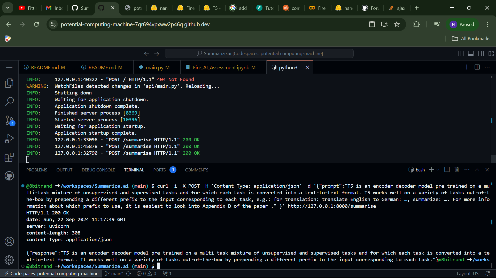

# Summarize.ai

This repository contains code for training a lightweight text summarization model using the t5-small architecture and deploying it via a RESTful API using FastAPI. The model is fine-tuned on the `CNN/DailyMail` dataset. This README provides an overview of the training process, differences before and after training, detailed code explanations, and instructions to run the API.

**Before Training**

Model: Pre-trained t5-small from Hugging Face.

- Capabilities: 
    * General language understanding and generation.
    * Not specialized in summarization of news articles.
- Limitations:
  - May produce less accurate summaries.
   - Lacks domain-specific knowledge from the CNN/DailyMail 
   
**After Training**

Model: Fine-tuned t5-small on CNN/DailyMail dataset.

- Capabilities:
    - Improved summarization of news articles.
    - Generates more concise and relevant summaries.
- Benefits:
    - Adapts to the style and content of the dataset.
    - Better performance on domain-specific summarization tasks.

#### How to run
> [!Note]
>
> for training, as it's a collab notebook you don't need to do much just run each cell.  


Install the dependencies

- transformers 
- datasets
- torch
- fastapi 
- uvicorn 
- pydantic
- sentencepiece

**Dataset Processing** 

Using 🤗 api load the `cnn_dailymail` whcih is an English-language dataset containing news articles The current which can be used for machine reading and comprehension and abstractive question answering.

get_tokenized_datasets

The T5 model treats every NLP task as a `text-to-text` problem. This means that both the input and output are text strings.By prepending `summarize` to the input text, we explicitly instruct the T5 model that the task at hand is summarization. This helps the model activate the appropriate learned parameters associated with summarization tasks during inference.

Creates a processed copy of the tokenized dataset and stores it into the local storage `t5_processed_data`

```
DatasetDict({
    train: Dataset({
        features: ['article', 'highlights', 'id'],
        num_rows: 287113
    })
    validation: Dataset({
        features: ['article', 'highlights', 'id'],
        num_rows: 13368
    })
    test: Dataset({
        features: ['article', 'highlights', 'id'],
        num_rows: 11490
    })
})

# dataset['train'][0]

{'article': 'LONDON, England (Reuters) -- Harry Potter star Daniel Radcliffe gains access to a reported £20 million ($41.1 million) fortune as he turns 18 on Monday, but he insists the money won\'t cast a spell on him. Daniel Radcliffe as Harry Potter in "Harry Potter and the Order of the Phoenix" To the disappointment of gossip columnists around the world, the young actor says he has no plans to fritter his cash away on fast cars, drink and celebrity parties. "I don\'t plan to be one of those people who, as soon as they turn 18, suddenly buy themselves a massive sports car collection or something similar," he told an Australian interviewer earlier this month. "I don\'t think I\'ll be particularly extravagant. "The things I like buying are things that cost about 10 pounds -- books and CDs and DVDs." At 18, Radcliffe will be able to gamble in a casino, buy a drink in a pub or see the horror film "Hostel: Part II," currently six places below his number one movie on the UK box office chart. Details of how he\'ll mark his landmark birthday are under wraps. His agent and publicist had no comment on his plans. "I\'ll definitely have some sort of party," he said in an interview. "Hopefully none of you will be reading about it." Radcliffe\'s earnings from the first five Potter films have been held in a trust fund which he has not been able to touch. Despite his growing fame and riches, the actor says he is keeping his feet firmly on the ground. "People are always looking to say \'kid star goes off the rails,\'" he told reporters last month. "But I try very hard not to go that way because it would be too easy for them." His latest outing as the boy wizard in "Harry Potter and the Order of the Phoenix" is breaking records on both sides of the Atlantic and he will reprise the role in the last two films.  Watch I-Reporter give her review of Potter\'s latest » . There is life beyond Potter, however. The Londoner has filmed a TV movie called "My Boy Jack," about author Rudyard Kipling and his son, due for release later this year. He will also appear in "December Boys," an Australian film about four boys who escape an orphanage. Earlier this year, he made his stage debut playing a tortured teenager in Peter Shaffer\'s "Equus." Meanwhile, he is braced for even closer media scrutiny now that he\'s legally an adult: "I just think I\'m going to be more sort of fair game," he told Reuters. E-mail to a friend . Copyright 2007 Reuters. All rights reserved.This material may not be published, broadcast, rewritten, or redistributed.',
 'highlights': "Harry Potter star Daniel Radcliffe gets £20M fortune as he turns 18 Monday .\nYoung actor says he has no plans to fritter his cash away .\nRadcliffe's earnings from first five Potter films have been held in trust fund .",
 'id': '42c027e4ff9730fbb3de84c1af0d2c506e41c3e4'}
```

**Model training**

We used the [T5ForConditionalGeneration](https://huggingface.co/transformers/v3.0.2/model_doc/t5.html#t5forconditionalgeneration) model from the Hugging Face Transformers library because it is specifically designed for sequence-to-sequence (seq2seq) tasks like text summarization. This model is part of the T5 (Text-to-Text Transfer Transformer) family, which treats every NLP task as a text-to-text problem, making it highly versatile and effective for generating summaries from input texts.

with the help of [transformers](https://huggingface.co/docs/transformers/en/training) library load the `t5-small` model from the 🤗 hub and finetune it on the dataset we processed.

> [!Note]
>
> Here im using the Google Colab to train my model with the free tiere gpu so the model size is a bottle neck. with more resources you can finetune a larger model. 

```python
training_args = TrainingArguments(
    output_dir='./results',
    num_train_epochs=4,   # can be adjusted if the model performance worse 
    per_device_train_batch_size=32, # limited by 15GB of Vram un GPU
    per_device_eval_batch_size=16,
    evaluation_strategy='steps',
    eval_steps=500,
    save_steps=1000, # save intermediate output so as to not lose trained model if runtime disconnected 
    logging_steps=100,
    learning_rate=5e-5, # as the model is pretrained a small LR works better, as I was training This was too low, but due to resource limitations I cannot experiment with other values like 3.3e-4, 3.3e-3 
    weight_decay=0.01, # reduce LR after steps
    save_total_limit=3,
    fp16=torch.cuda.is_available(), # used for faster training and save space in memory without using  32 bit 
)

trainer.train() # start training process 
# use  trainer.train(resume_from_checkpoint=True) to load from the saved checkpoints  
```
Model is automatically saved in the results/ folder and the related tensorboard graphs 

Finaly save the trained model 
```python
trainer.save_model('/content/drive/MyDrive/Colab Notebooks/fireai/t5-small-cnn_dailymail')
tokenizer.save_pretrained('/content/drive/MyDrive/Colab Notebooks/fireai/t5-small-cnn_dailymail')

```

Next step is to push the model to 🤗 My model is [here](https://huggingface.co/nand-tmp/t5-small-cnn_dailymail/) We will load the model in our api code from HF directly.

#### API 
```bash 
fastapi dev api/main.py
```
I used github codespaces it lets you use and forward ports and here is the request response format 

```bash
curl -i -X POST -H 'Content-Type: application/json' -d '{"prompt":"T5 is an encoder-decoder model pre-trained on a multi-task mixture of unsupervised and supervised tasks and for which each task is converted into a text-to-text format. T5 works well on a variety of tasks out-of-the-box by prepending a different prefix to the input corresponding to each task, e.g.: for translation: translate English to German: …, summarize: …. For more information about which prefix to use, it is easiest to look into Appendix D of the paper ." }' http://127.0.0.1:8000/summarise
```




